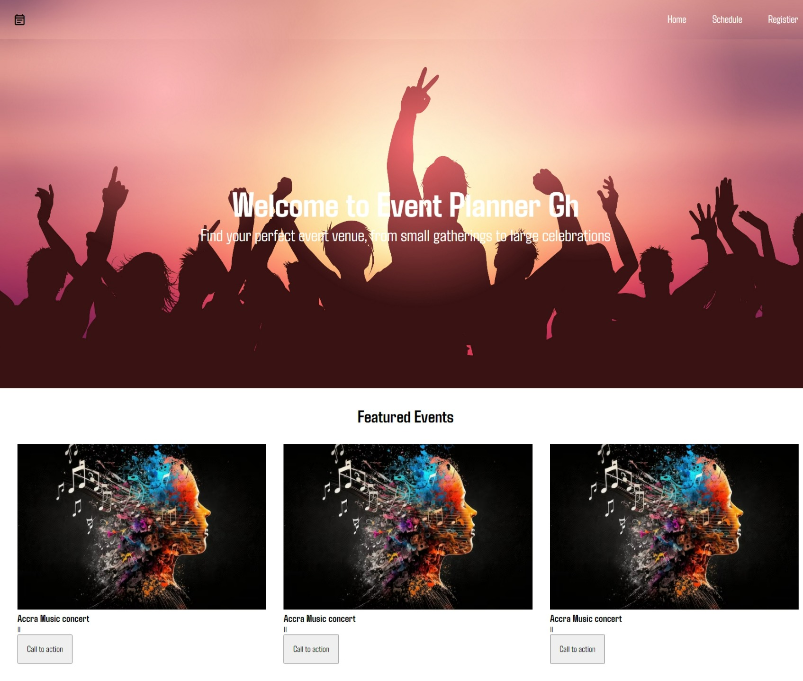

<!-- Please update value in the {}  -->

<h1 align="center">Web Technologies Midsem Exam</h1>

   Solution for a challenge from  <a href="http://devchallenges.io" target="_blank">Devchallenges.io</a>.

  <h3>
    <a href="https://moderninn.netlify.app/">
      Demo
    </a>
  </h3>

<!-- OVERVIEW -->

## Overview

### Built With

<!-- This section should list any major frameworks that you built your project using. Here are a few examples.-->

- [HTML](https://www.w3schools.com/html/)
- [CCS](https://www.w3schools.com/css/)
- [Javascript](https://www.w3schools.com/js/)

## Features

<!-- List the features of your application or follow the template. Don't share the figma file here :) -->

This application/site was created as a submission to my Web Technologies Course Mid Sem

## Contact
- GitHub [@EMA-Wolf](https://github.com/EMA-Wolf)